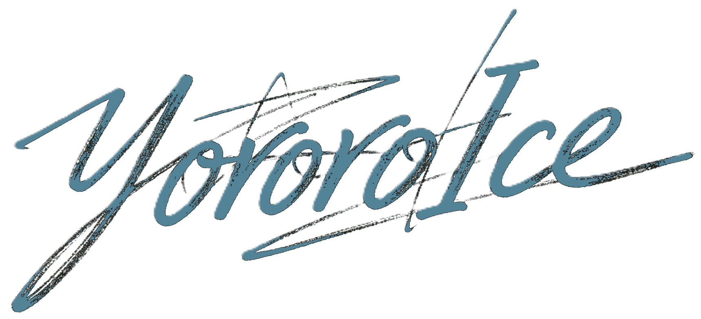
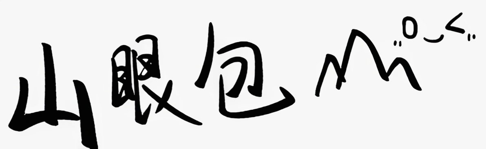

<p align="center">
  
  
</p>

<p align="center">
  <strong>YOROROICE ARK</strong> — 一个明日方舟风格的个人门户与博客系统。
</p>

<p align="center">
  
  
  
  
</p>

---

## 技术栈

| 类别 | 技术 |
|------|------|
| 框架 | Next.js 16 (App Router) |
| UI 库 | React 19 |
| 样式 | Tailwind CSS 4 + SCSS Modules |
| 组件 | shadcn/ui + Radix UI |
| 状态管理 | Zustand |
| 动画 | Lenis 平滑滚动 |
| 工具 | crypto-js, clsx, zod |

## 快速开始

```bash
# 安装依赖
npm install

# 启动开发服务器
npm run dev
# 访问 http://localhost:9999
```

开发时如需其他设备访问网页，可参考 [内网穿透](docs/tunnel.md)

### 环境变量

创建 `.env` 文件：

```env
IPINFO_API_KEY=your_ipinfo_key
BACKEND_URL=https://your-backend-url.com
ADMIN_UIDS=uid1,uid2
```

## 项目结构

```
src/
├── app/
│   ├── login/          # 登录页
│   └── page.tsx        # 首页
├── components/
│   ├── arks/           # 自定义组件 (按钮、输入框、球体等)
│   └── ui/             # shadcn/ui 组件
├── hooks/              # 自定义 Hooks
├── store/              # Zustand 状态管理
├── context/            # React Context
├── lib/                # 工具函数
└── styles/             # 全局样式
```

## License

[MIT](LICENSE) © 2026 yororoA, YororoIce
