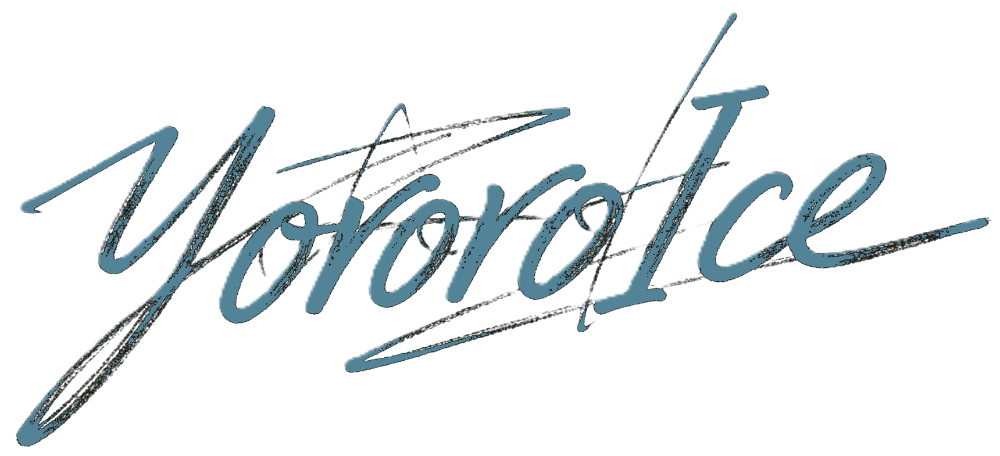
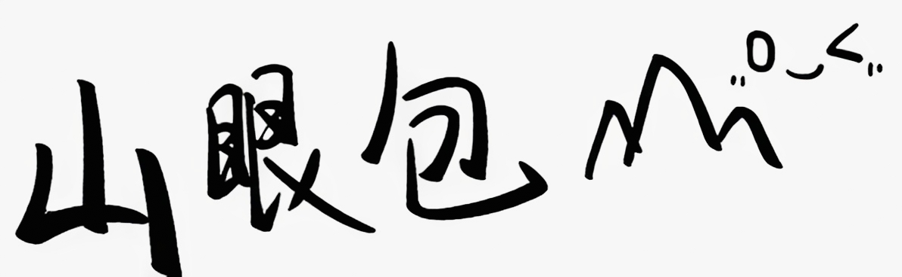

<p align="center">
  
  
</p>

<p align="center">
  <strong>YOROROICE ARK</strong> — 一个明日方舟风格的个人门户与博客系统。
</p>

<p align="center">
  
  
  
  
</p>

---

Ark 迁移自 [yororoIceBlog_React](https://github.com/yororoA/yororoIceBlog_React)，复用 [yororoIceBlogBackend](https://github.com/yororoA/yororoIceBlogBackend) 的数据与接口。博客包含文章、动态、图库、归档、留言、友链、聊天和实验室，兼容旧 `/town/*` 链接。

当前视觉取自《明日方舟》六周年 PV 的白底朱红、衬线大字和圆弧构图。来源版本、接口差异及验证范围见 [迁移记录](docs/ark-migration.md)。

## 技术栈

| 类别 | 技术 |
|------|------|
| 框架 | Next.js 16 (App Router) |
| UI 库 | React 19 |
| 样式 | Tailwind CSS 4 + SCSS Modules |
| 组件 | shadcn/ui + Radix UI |
| 状态管理 | Zustand + SWR |
| 动画与交互 | Lenis 平滑滚动、web-mascot 桌宠 |
| 内容与工具 | react-markdown, remark-gfm, Node crypto, zod |

## 快速开始

建议使用 Node.js 24 LTS。

```bash
# 安装依赖
npm install

# 启动开发服务器
npm run dev
# 访问 http://localhost:9999
```

`/home` 为博客首页，`/login` 为账号接入页。`BACKEND_URL` 填后端服务根地址，不附加 `/api`；只供服务端使用。`ADMIN_UIDS` 应与后端配置保持一致。

本地接口回归会启动独立 Next 实例和内存后端，不读取真实后端数据：

```bash
npm run verify:blog
# 或保留测试预览，访问 http://127.0.0.1:10000
npm run verify:blog:preview
```

测试使用本机 10000 / 10001 端口，结束预览后再运行下一次回归。测试账号和数据仅存在于该内存后端；详情见迁移记录。

开发时如需其他设备访问网页，可参考 [内网穿透](docs/tunnel.md)

### 环境变量

创建 `.env` 文件：

```env
IPINFO_API_KEY=your_ipinfo_key
BACKEND_URL=https://your-backend-url.com
ADMIN_UIDS=uid1,uid2
```

## 项目结构

```
src/
├── app/
│   ├── login/          # 登录页
│   ├── home/           # 博客首页
│   ├── (blog)/         # 内容、聊天与社区页面
│   └── api/            # 同源内容网关与账号接口
├── components/
│   ├── arks/           # 自定义组件 (按钮、输入框、球体等)
│   ├── blog/           # 博客栏目与共享布局
│   └── ui/             # shadcn/ui 组件
├── hooks/              # 自定义 Hooks
├── store/              # Zustand 状态管理
├── context/            # React Context
├── lib/                # 工具函数
└── styles/             # 全局样式
```

## License

Ark 自有代码使用 [MIT](LICENSE) © 2026 yororoA, YororoIce。

项目集成的 `web-mascot` 引擎使用 `GPL-3.0-or-later`；Neuron 与 Eviling
素材使用 `CC-BY-NC-SA-4.0`，仅限非商业用途。完整归属与对应源码见
[第三方说明](docs/third-party/web-mascot.md)。
